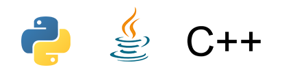

[GO](https://golang.org/) is an open source programming language that makes it easy to build simple, reliable, and efficient software. I have always been interested in learning GO and applying it to data science, and have expierimented with it in the past, but decided to make a fresh start and get back to some of the basics. The community that surrounds GO is really what draws me into the language, and the real world applications for the language are growing everyday.

_Here is a quick list of some big companys that use GO_


<h3>Why a New Language?</h3>

With Python, Java, and C/C++ you might be wondering why there was a need for GO in the first place. Well there are a few reasons actaully.

A few Google developers realized that they were running into a few issues that conventional programming languages made difficult to solve. For example we can look at python, in that it is very easy to use, but due to it being an interpritive language, it can be slow when scaled up to applications that Google would be using it for. Java is very quick, but overtime its typescript has become more and more complex as new features and layers have been added over time. C/C++ can be fast aswell but can face issues with slow compile times and complex type systems. Also these languages were developed at a time when multi-threaded applications were very limited, so concurrency at best has been patched in.


So what does GO bring to the party to address a few of these concerns?

Go is a strong and statically typed language, similar to java and C++. Also, as I mentioned in the intro, GO has an excellent commununity that helps ensure the progress of the language, as well as the ability for new developers to ask for help when getting started.

<h4>Key features</h4>

- Simplicity
  - Although this may sacrifice the ability for certain extra features, it ensures that the language reamins straight forward and easy to use.
- Fast compile times
  - This allows for quicker development due to less waiting around for long compiles.
- Garbage collected
  - When developing applications you do not have to manage your own memory. The reason for that comes back to the simplicity and faster development.
- Built-in concurrcency
  - There is no need to install any additional libraries or dependencies when building concurrent applications.
- Compile to standalone binaries
  - This means when you compile your GO application everything is going to be bundled into a single binary related to the GO application itself.

<h3>Getting Started</h3>

Since I am running Windows 10, all I had to do was download the installer from [here](https://learn.go.dev/), run the .exe, and follow the installation prompts. A while back there used to be an additional step with setting up the enviroment variables, but that is now done automatically so installing and getting started is pretty simple in Windows.

To Start we will use the default [playground](https://play.golang.org/) code that the GO website provides, which allows new users or curious individuals the oppurtunity to mess around with some of the features. Click the playground link if you want to follow along, but here is what the code should look like to start.

```
package main

import (
	"fmt"
)

func main() {
	fmt.Println("Hello, playground")
}
```

<h3>Variables</h3>
With the example code above, using the *Print.ln* function will only ever do that one thing, in this case it will print out *Hello, playground*.  In order to add a little bit more flexability to our application, we are going to introduce variables.
<br></br>
<h4>Declaring Variables</h4>

```
package main

import (
"fmt"
)

func main() {
var i int
i = 42
fmt.Println(i)
}

```

TLDR:

- GO fixes some stuff other languages can't
- Getting started
- Variables

## Topics Covered

1. GO
2. Data Science
3. Basics of GO

```

```
