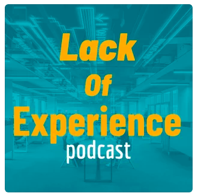

Today I had the pleasure of sharing my knowledge and understanding of Blockchain Technology on the "Lack of Expierince" Podcast!

Take a listen here!

<iframe allow="autoplay *; encrypted-media *; fullscreen *" frameborder="0" height="175" style="width:100%;max-width:660px;overflow:hidden;background:transparent;" sandbox="allow-forms allow-popups allow-same-origin allow-scripts allow-storage-access-by-user-activation allow-top-navigation-by-user-activation" src="https://embed.podcasts.apple.com/us/podcast/cryptocurrencies-part-2-ft/id1528636608?i=1000505412537"></iframe>

## Topics Covered

1. Bitcoin
2. Blockchain
3. Ethereum
