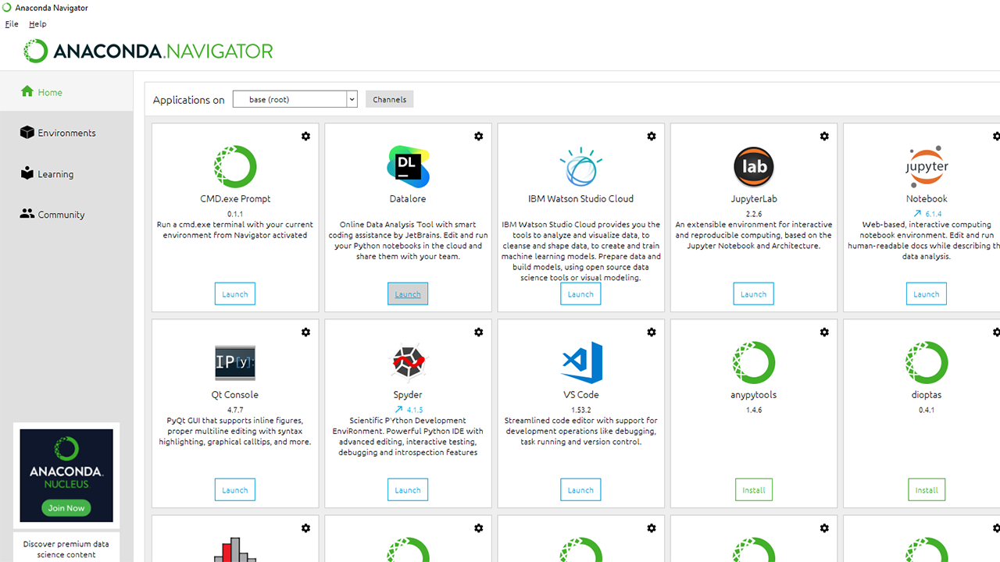
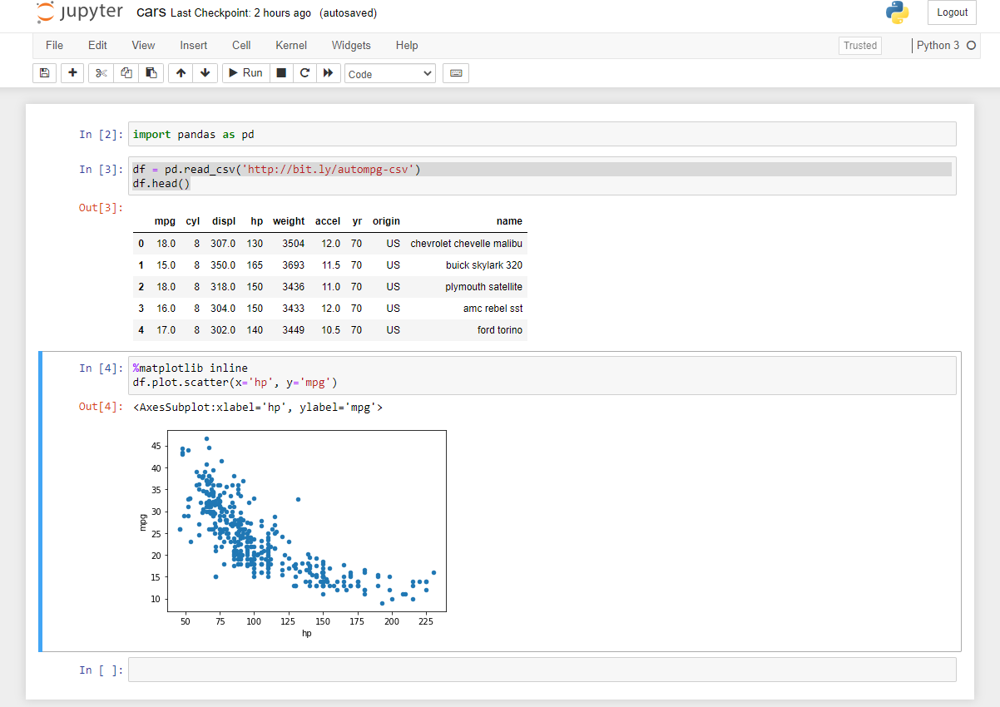

[Anaconda](<https://en.wikipedia.org/wiki/Anaconda_(Python_distribution)>) is a distribution of the Python and R programming languages for scientific computing (data science, machine learning applications, large-scale data processing, predictive analytics, etc.), that aims to simplify package management and deployment.

One of the challenges of working on a data science project is that there are many open-source packages you need to have installed.
Although these packages have components written in many different languages, they are commonly utilized with the python programming language. Installing these packages and ensuring you have compatible versions can be challenging.
The Anaconda distro provides an efficient way to install, upgrade, and run these packages.

_Here are some commonly used packages that come pre-installed with Anaconda_

<h3>Getting Started</h3>

Since I am running Windows 10, all I had to do was download the installer from [here](https://www.anaconda.com/products/individual#windows), run the .exe, and follow the installation prompts.

Rather than running everything via terminal or cmd, Anaconda comes with a simple to use GUI that makes running and managing your packages easy.

I launched a jupyter notebook to test out some of the pre-installed libraries and run some test data to get started.
The data I used is sample car data found [here](http://bit.ly/autompg-csv).

Here I was able to:

- Import the pandas library
- Load and preview data into our data frame
- Use Matplotlib to build a scatter plot of horsepower vs. mpg

## Topics Covered

1. Anaconda
2. Python
3. Jupyter
