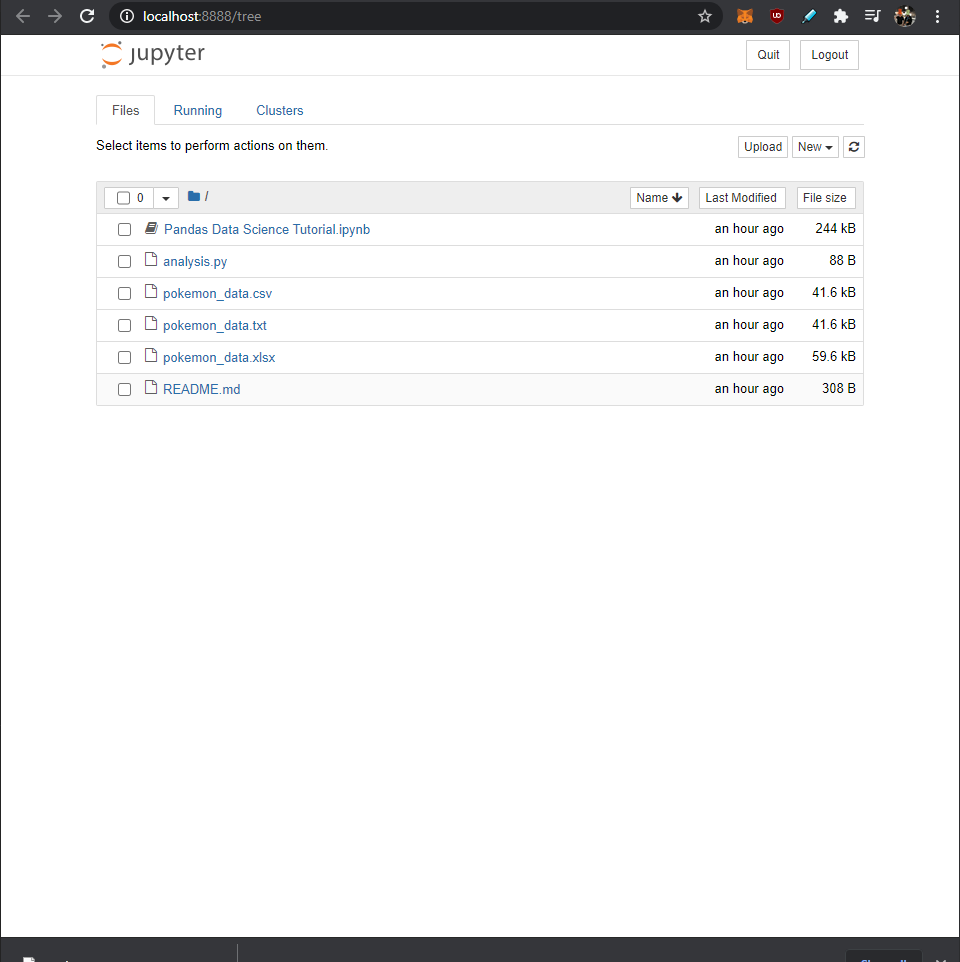

[Pandas](https://pandas.pydata.org/) is a fast, powerful, flexible, and easy to use open-source data analysis and manipulation tool, built on top of the Python programming language.  

Today I decided to dive deeper into what we can do with pandas by watching yet another great tutorial by Keith Galli.

<h3>Getting Started</h3>
Why Pandas?
Many of the concepts I learned today can be done in excel, so why use python and pandas?

1. There is much more flexibility when using python and pandas than the limitations that excel has.

2. Pandas allows you to work with much larger data sets than excel, so working with big data is not a limitation.

To get started, I downloaded a set of data based on pokemon stats provided in the tutorial.  

Although this may sound silly, the data available for pokemon stats is easily accessible and provides a fun and clean data set to get started.

Although most text editors would be sufficient for this project, I wanted to follow along using Jupyter. Jupyter is built to support interactive data science and scientific computing across all programming languages. So as I grow and learn more as a data scientist, this tool will come in handy!

First, I had to import pandas library into our script, and for convience, set it as 'pd', so later I could just call 'pd' rather than pandas.
To read the csv file with the downloaded data, I used the _read_csv_ function and to check used the print function to show the raw data.

Success!

The script pulled the data in from the csv file and printed it out in raw form.
The great thing about pandas is that it can also read .txt tab separated data, as well as excel files.

<h3>Reading Data in Pandas</h3>

For a quick start to reading data, I used the _print(df.columns)_ command to list the different headers listed in this csv file.

Using the command _print(df['Name'])_ allowed me to only get the data from the names column. There are multiple variations on how to use this command to return certain sets of data.

It is also possible to get rows based on a specific condition by running df.loc. If I wanted to list only Grass type pokemon I could run something like this.

We can see that I could find only Grass type pokemon while retaining all the rest of their data by using this method of sorting.

<h3>Sorting/Describing Data</h3>

Using the _df.describe()_ function, I can quickly sort and describe the different headings.

To sort the data, I can use variations of _df.sort_values_. This would allow me to sort the data in alphabetic or numerical order. It is also possible to combine different variables and sort them together or seperatly.

<h3>Making changes to the data</h3>

The great thing about coding is that there are multiple ways of getting from point a to point b. This allows me to put my creative hat on and gives me the confidence to try new programming things.

For this example, I followed the tutorial and created a new column called total. I was able to rank the pokemon by adding specific attributes and starting a new variable with that.

By running the command _df['Total'] = df['Hp'] + df['Attack'] ..._ , I get a new column containt the total stat.

To drop a column I can use _df = df.drop(columns=['Total'])_ which drop the newly created column. This is necessary if we add the column with our previous method because after running it, jupyter keeps it in the memory for that data frame.

To avoid having to use this command to remove the column, I can use a method that creates a more succinct variable,

To do this I can use the function _df['Total'] = df.iloc[:, 4:10].sum(axis=1)_. It is worth noting that although we want values from columns 4-9, we have to end our list at 10 because of the nature of how python and pandas read lists. The end variable is exclusive, so the list here really ends at 9.

It is also possible to rearrange the data by setting _df = df[newly defined data order]_, which could range from typing a new order by hand or concatenating the data and using numbers to order the list.

Check the Pandas [docs](https://pandas.pydata.org/docs/) for a more in-depth list of commands if you are interested.
It is also worth noting that hardcoding data numerically can be dangerous if new data is added to the set. This is why it may be better to list out the different columns by name.

<h3>Saving Our Data</h3>

Pandas has a built-in function _to_csv_ that I can use to export a modified version of the data set. To do this I enter _df.to_csv('modified.csv')_ which will export a new file.

After running _df.to_csv('modified.csv')_, we can see a new file called modified.csv in our workspace.

We can open that file in excel and see our modified data table.

Stay tuned for part two, where I explore deeper into the possibilities of Pandas!

## Topics Covered

Tutorial for this by Keith Galli can be found here: https://www.youtube.com/watch?v=vmEHCJofslg

1. Python
2. Pandas
3. Jupyter
