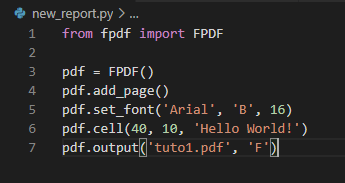
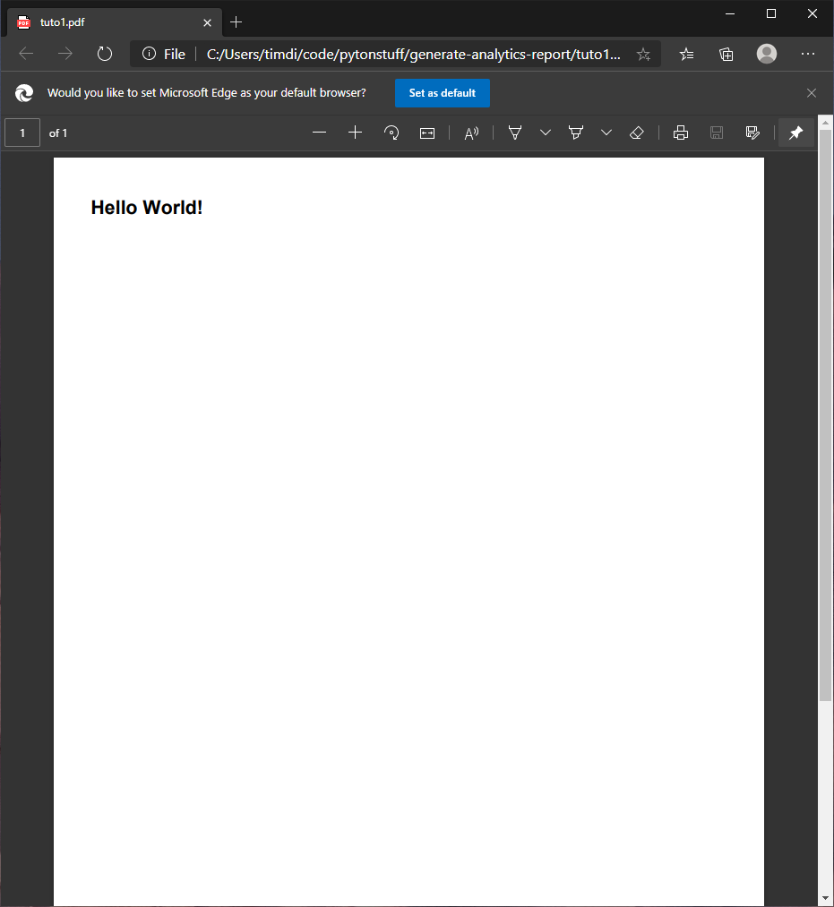
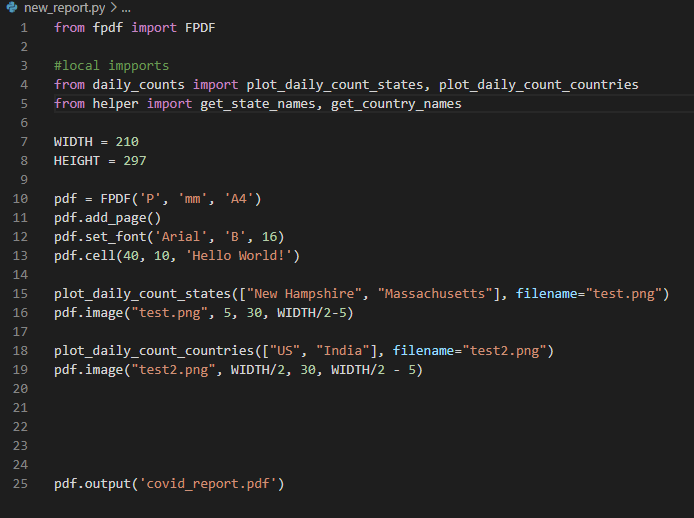
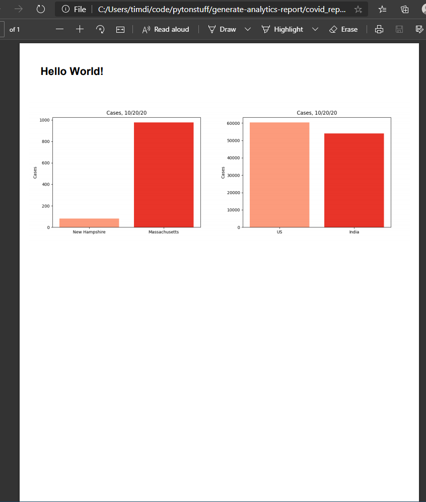
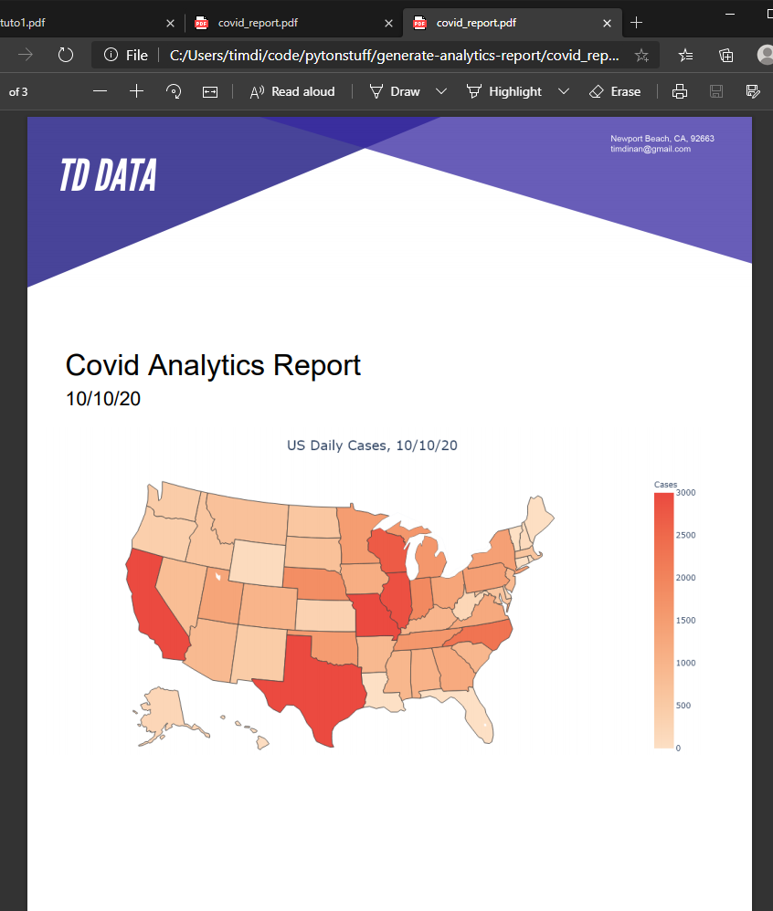

Today I learned how to create a PDF analytics report using Python with FPDF library following a tutorial by Keith Galli!

To start, I learned the basics of how to use FPDF by importing the FPDF library to my code, and running a basic script.

Running that little snippet of code generated this PDF.

Now to add some test data, the tutorial that I followed used covid-19 statistics provided by Johns Hopkins, so out of conviencince I used the same data.

Using these commands, I am able to take my data, format into graphs, and import that graph into my PDF.

Running this, generates a pdf with my new formatted graphs!

Now to add more pages using the command pdf.add_page, which allows me to add the content following onto a new page. This gives me the ability to seperate pages, as well as add a title page that I can format using the FPDF library.

After creating a professional-looking header using Adobe Illustrator, I placed it at the top of the PDF to give this report and any further reports generated with this script a professional look. The heat map on the cover uses Plotly. Using Plotly to create this map means it will dynamically change based on state by state data. One cool thing about Plotly is that it creates interactive maps as well!
At first, I was using a downloaded set of data, but to test for changes, I updated it to display data from the Johns Hopkins dataset from the previous day.

I also adjusted the display date on the cover using the command day = (datetime.today() - timedelta(days=1)).strftime("%m/%d/%y").replace("/0", "/").lstrip("0"). This command uses the datetime library, and formats our date into a more presentable style.

Next, I will be learning how to take these reports, automatically make this script run, and email the report to whoever needs it!

## Topics Covered

Tutorial for this by Keith Galli can be found here: https://www.youtube.com/watch?v=UmN2_R4KEg8&t=1771s

1. Python
2. FPDF
3. Numpy
4. Pandas
5. Plotly
